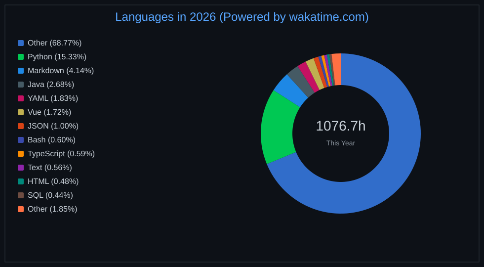

<picture>
  <source media="(prefers-color-scheme: dark)" srcset="https://cdn.jsdelivr.net/gh/RudyGo8/RudyGo8/assets/images/boycoding_compressed.gif" />
  <source media="(prefers-color-scheme: light)" srcset="https://cdn.jsdelivr.net/gh/RudyGo8/RudyGo8/assets/images/developer.svg" height="225px" />
  
</picture>

&nbsp;

  &emsp;
  &emsp;
  &emsp;
  &emsp;
  &emsp;
  &emsp;
  &emsp;
  <!-- visitor -->
  &emsp;
   

<picture>
  <source media="(prefers-color-scheme: dark)" srcset="https://cdn.jsdelivr.net/gh/RudyGo8/RudyGo8/profile-snake-contrib/github-contribution-grid-snake-dark.svg" />
  <source media="(prefers-color-scheme: light)" srcset="https://cdn.jsdelivr.net/gh/RudyGo8/RudyGo8/profile-snake-contrib/github-contribution-grid-snake.svg" />
  
</picture>

#  🙋 Hello

<tabl width="100%">

<tr><td>

### 🤺 About Me

&emsp;&emsp;嗨，你好，我是Rudy，一名热爱AI、运动、读书、旅行的热情boy~

&emsp;&emsp;处于人工智能时代，善用AI工具产生价值，希望能成为一名优秀的AI工程师。

&emsp;&emsp;一枚与时俱进、终生学习、软硬AI全栈的Coder！

&emsp;&emsp;<strong>Either you get it, or you learn from it.</strong>

&emsp;&emsp;<strong>You are more than what you have become now！</strong>

 </td>
  </tr>

  <tr>
    <td>

### 📃 Recent Blog

<!-- feed start -->
- Jul 10 - [AI工具学习](https://blog.grover.top/2026/07/10/ai%e5%b7%a5%e5%85%b7%e5%ad%a6%e4%b9%a0/)
- May 08 - [学习Hermes Agent (openclaw 对比）](https://blog.grover.top/2026/05/08/%e5%ad%a6%e4%b9%a0hermes-agent/)
- Apr 24 - [AI日报定时推送自动化](https://blog.grover.top/2026/04/24/ai%e6%97%a5%e6%8a%a5%e5%ae%9a%e6%97%b6%e6%8e%a8%e9%80%81%e8%87%aa%e5%8a%a8%e5%8c%96/)
- Apr 01 - [agent | codex 最佳实践方案（自动化流程）](https://blog.grover.top/2026/04/01/agent-codex-%e6%9c%80%e4%bd%b3%e5%ae%9e%e8%b7%b5%e6%96%b9%e6%a1%88/)
- Mar 23 - [浅入深出-Agent复习(第一性原理分析)](https://blog.grover.top/2026/03/23/%e6%b5%85%e5%85%a5%e6%b7%b1%e5%87%ba-agent%e5%a4%8d%e4%b9%a0%e7%ac%ac%e4%b8%80%e6%80%a7%e5%8e%9f%e7%90%86/)
<!-- feed end -->

</td>

</tr>

</table>

  <picture>
    <source media="(prefers-color-scheme: dark)" srcset="https://readme-jokes.vercel.app/api?hideBorder&bgColor=%23121212" />
    <source media="(prefers-color-scheme: light)" srcset="https://readme-jokes.vercel.app/api?hideBorder&bgColor=%ffffff" />
    
  </picture>

<table>
  <tr>
    <td>
      <picture>
        <source media="(prefers-color-scheme: dark)" srcset="https://github-readme-activity-graph.vercel.app/graph?username=RudyGo8&theme=xcode&bg_color=FF000000&hide_border=true" />
        <source media="(prefers-color-scheme: light)" srcset="https://github-readme-activity-graph.vercel.app/graph?username=RudyGo8&theme=xcode&bg_color=FF000000&color=000000&hide_border=true" />
        
      </picture>
  </tr>
</table>

 

<!-- 
 
 -->
<!-- <h2>⏱️ WakaTime 年度统计</h2> -->

  

<table>
  <tr>
    <td></td>
    <td></td>
  </tr>
</table>

 

<picture>
  <source media="(prefers-color-scheme: dark)" srcset="https://cdn.jsdelivr.net/gh/RudyGo8/RudyGo8/profile-3d-contrib/profile-night-rainbow.svg" />
  <source media="(prefers-color-scheme: light)" srcset="https://cdn.jsdelivr.net/gh/RudyGo8/RudyGo8/profile-3d-contrib/profile-gitblock.svg" />
  
</picture>

<table>
  <tr>
    <td>
      
    </td>
    <td>
      
    </td>
  </tr>
</table>

