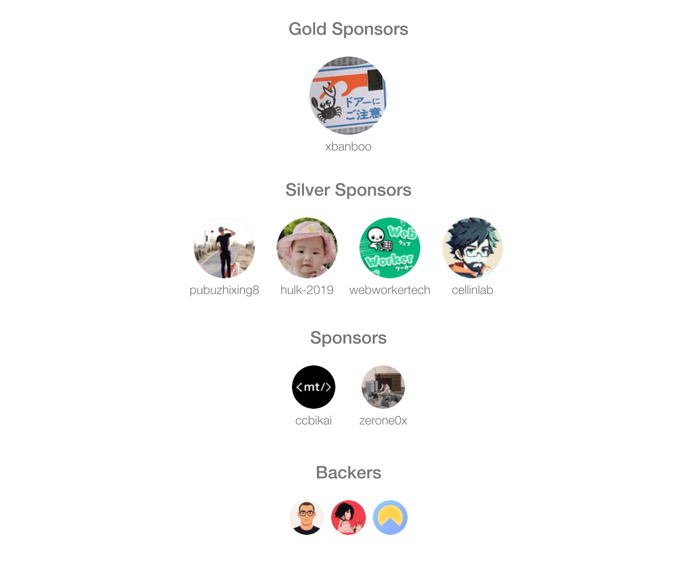

[;Welcome%20to%20my%20profile!&center=true&size=27)](https://git.io/typing-svg)

<picture>
  <source media="(prefers-color-scheme: dark)" srcset="https://cdn.jsdelivr.net/gh/RudyGo8/RudyGo8/assets/images/coding.gif" />
  <source media="(prefers-color-scheme: light)" srcset="https://cdn.jsdelivr.net/gh/RudyGo8/RudyGo8/assets/images/developer.svg" height="225px" />
  
</picture>

&nbsp;

  <!-- visitor -->
  &emsp;

<picture>
  <source media="(prefers-color-scheme: dark)" srcset="https://cdn.jsdelivr.net/gh/RudyGo8/RudyGo8/profile-snake-contrib/github-contribution-grid-snake-dark.svg" />
  <source media="(prefers-color-scheme: light)" srcset="https://cdn.jsdelivr.net/gh/RudyGo8/RudyGo8/profile-snake-contrib/github-contribution-grid-snake.svg" />
  
</picture>

<!-- 如果你想添加打赏功能，可以在这里添加 -->

#  🙋 Hello

<table>

<tr><td>

### 🤺 About Me

&emsp;&emsp;你好，我是 Rudy / Chao Ge。

&emsp;&emsp;热爱 Python 开发，专注于 AI 和自动化领域。

&emsp;&emsp;正在学习：大模型、RAG、智能体。

&emsp;&emsp;<strong>Building the future with code.</strong>

</tr></td>

<tr><td>

### 🔭 Currently Working On

<!-- 你可以在这里添加你当前正在做的项目 -->

</td></tr>

<tr><td>

### 📊 GitHub Stats

</td></tr>

</table>

  <picture>
    <source media="(prefers-color-scheme: dark)" srcset="https://readme-jokes.vercel.app/api?hideBorder&bgColor=%23121212" />
    <source media="(prefers-color-scheme: light)" srcset="https://readme-jokes.vercel.app/api?hideBorder&bgColor=%ffffff" />
    
  </picture>

<picture>
  <source media="(prefers-color-scheme: dark)" srcset="https://github-readme-streak-stats.herokuapp.com/?user=RudyGo8&theme=dark&hide_border=true" />
  <source media="(prefers-color-scheme: light)" srcset="https://github-readme-streak-stats.herokuapp.com/?user=RudyGo8&theme=light&hide_border=true" />
  
</picture>

<!-- GitHub Metrics 卡片 - 需要设置 GitHub Actions 后才能显示 -->
<!--  -->

<table>
  <tr>
    <td>
      <picture>
        <source media="(prefers-color-scheme: dark)" srcset="https://github-readme-activity-graph.vercel.app/graph?username=RudyGo8&theme=xcode&bg_color=FF000000&hide_border=true" />
        <source media="(prefers-color-scheme: light)" srcset="https://github-readme-activity-graph.vercel.app/graph?username=RudyGo8&theme=xcode&bg_color=FF000000&color=000000&hide_border=true" />
        
      </picture>
  </tr>
</table>

 

 

<!-- gif -->

<picture>
  <source media="(prefers-color-scheme: dark)" srcset="https://cdn.jsdelivr.net/gh/RudyGo8/RudyGo8/profile-3d-contrib/profile-night-rainbow.svg" />
  <source media="(prefers-color-scheme: light)" srcset="https://cdn.jsdelivr.net/gh/RudyGo8/RudyGo8/profile-3d-contrib/profile-gitblock.svg" />
  
</picture>

<!-- GitHub Metrics 详细卡片 - 需要设置 GitHub Actions 后才能显示 -->
<!-- 
<table>
  <tr>
    <td></td>
  </tr>
</table>

<table>
  <tr>
    <td></td>
    <td></td>
  </tr>
  <tr>
    <td></td>
    <td></td>
  </tr>
  <tr>
    <td></td>
    <td></td>
  </tr>
  <tr>
    <td></td>
    <td></td>
  </tr>
  <tr>
    <td></td>
    <td></td>
  </tr>
</table>
-->

